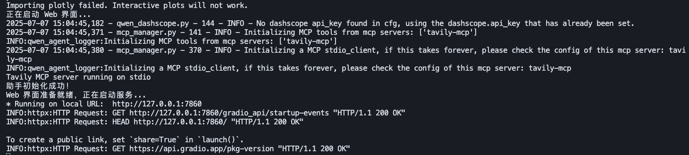
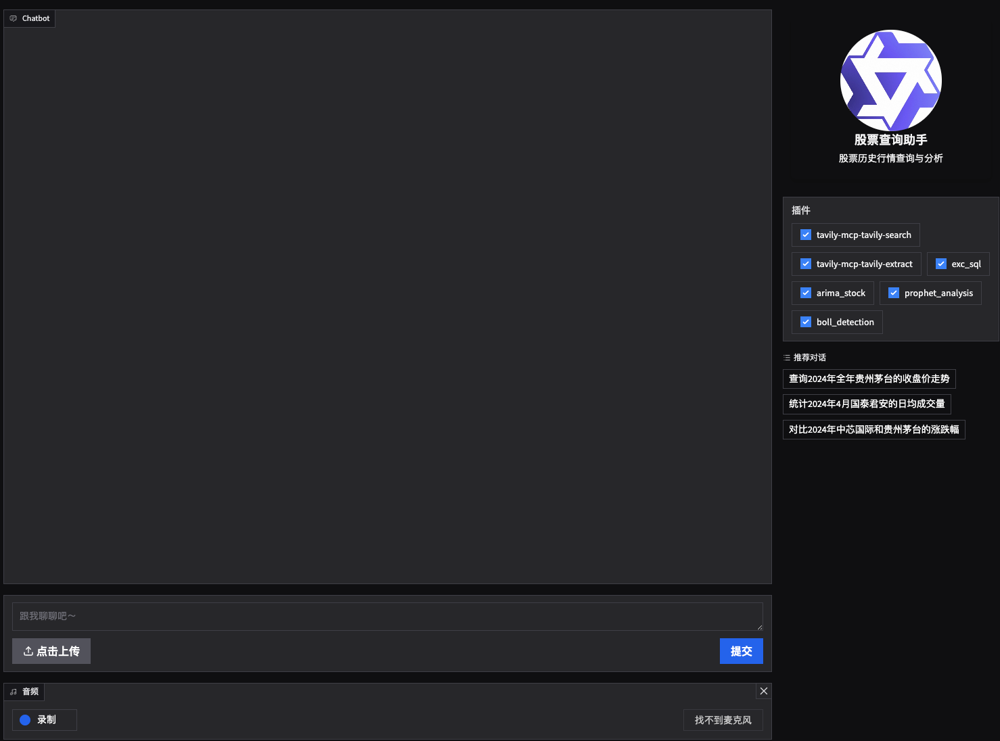

# Like it? Give it a star! ⭐ | 好用点个星！⭐
# 股票智能分析助手

## 项目简介

本项目是一个基于大模型和多种时间序列分析方法的股票智能分析助手，支持历史行情查询、ARIMA预测、Prophet周期分析、BOLL异常检测等功能，适合金融数据分析、量化研究和教学演示。

- 支持自然语言提问，自动识别股票名称/代码、时间范围、分析类型
- 提供Web图形界面和终端交互两种模式
- 自动生成可视化图表，便于数据洞察
- 内置FAQ知识库，辅助分析和答疑

---

## 🔧 系统环境要求

- Python 3.8+
- MySQL 数据库（建议 5.7+）
- 依赖包见 `requirements.txt`

安装依赖：
```bash
pip install -r requirements.txt
```

---

## 安装与运行步骤

### 1. 克隆项目
```bash
git clone <你的仓库地址>
cd <项目目录>
```

### 2. 数据准备
1. - **方式一：使用自带样本数据**
   - 自己整理 `stock_history-2.csv` 进行测试。
   - **方式二：自定义采集数据**
   - 配置好 Tushare Token 后，运行 `fetch_stock_history.py` 抓取数据，生成 `stock_history.xlsx`。
2. 再运行 `convert_and_sort_stock_history.py` 生成 `stock_history-2.csv`


### 3. 数据库初始化
1. 启动 MySQL，创建数据库（如 `stock_history`）。
2. 复制 `stock_history_table.sql` 内容，在mySql中创建表结构。
3. 用 `import_data.py` 将 `stock_history-2.csv` 数据导入表中。或者自己去数据库导入csv。


### 4. 配置环境变量
- 设置大模型 API Key（如 DashScope）：
  ```bash
  export DASHSCOPE_API_KEY=你的key
  ```
- 如需自定义数据库连接，可修改 `assistant_stock_bot.py` 中的 `DB_CONFIG`。

### 5. 启动项目
- **Web界面模式（推荐）**
  ```bash
  python assistant_stock_bot.py
  ```
  默认启动 Web 图形界面，浏览器访问提示的地址即可。
- **终端模式**
  ```bash
  # 修改 assistant_stock_bot.py 末尾为 app_tui()
  python assistant_stock_bot.py
  ```
---

---

---

## 帮助
- 项目开发思路见 `开发思路.md`
- 数据表字段说明见 `数据字段说明.md`

---

## 常见问题

1. **数据库连接失败？**
   - 检查 MySQL 是否启动，账号密码是否正确，端口是否开放。
2. **DashScope/大模型API不可用？**
   - 检查 API Key 是否设置，网络是否可访问。
3. **数据导入报错？**
   - 检查表结构与数据格式是否一致，建议用 pandas 读取 Excel/CSV 后写入数据库。
4. **Web界面打不开？**
   - 检查是否有端口冲突，或浏览器安全策略。

---

## 项目结构说明

- `assistant_stock_bot.py`  主程序，集成所有核心功能
- `requirements.txt`       依赖包清单
- `stock_history_table.sql` 数据库建表SQL
- `stock_history-2.csv`/`stock_history.xlsx`  样本数据
- `fetch_stock_history.py` 数据抓取脚本
- `convert_and_sort_stock_history.py` 数据清洗脚本
- `faq.txt`                FAQ知识库
- `开发思路.md`            项目开发思路
- `数据字段说明.md`         数据表字段详细说明
- `image_show/`            自动生成的分析图表
- `workspace/`             工具与扩展代码

---

## 优化建议

- 建议将数据库、API Key 等敏感信息写入 `.env` 或 `config.py`，避免硬编码
- 可增加 `import_data.py` 脚本，自动导入 Excel/CSV 数据到 MySQL
- 可拆分主程序为 `core/`、`web/`、`tools/` 等子目录，便于维护
- 增加单元测试和示例截图，提升项目易用性

---

## 🧾 许可证与商业使用
本项目采用 **AGPL-3.0 许可证**，这意味着：
- 您可以自由地使用、修改和分发本项目，但必须遵守 AGPL-3.0 协议要求
- **闭源商用需要购买商业授权**。授权选项如下：
  - 一年授权：360元
  - 三年授权：999元
  - 永久授权：3999元
- 项目的**重要贡献者**可免费获得商业授权

> ℹ️ 我们强烈建议优先考虑AGPL-3.0合规方案。如有商业授权疑问，请邮件联系作者